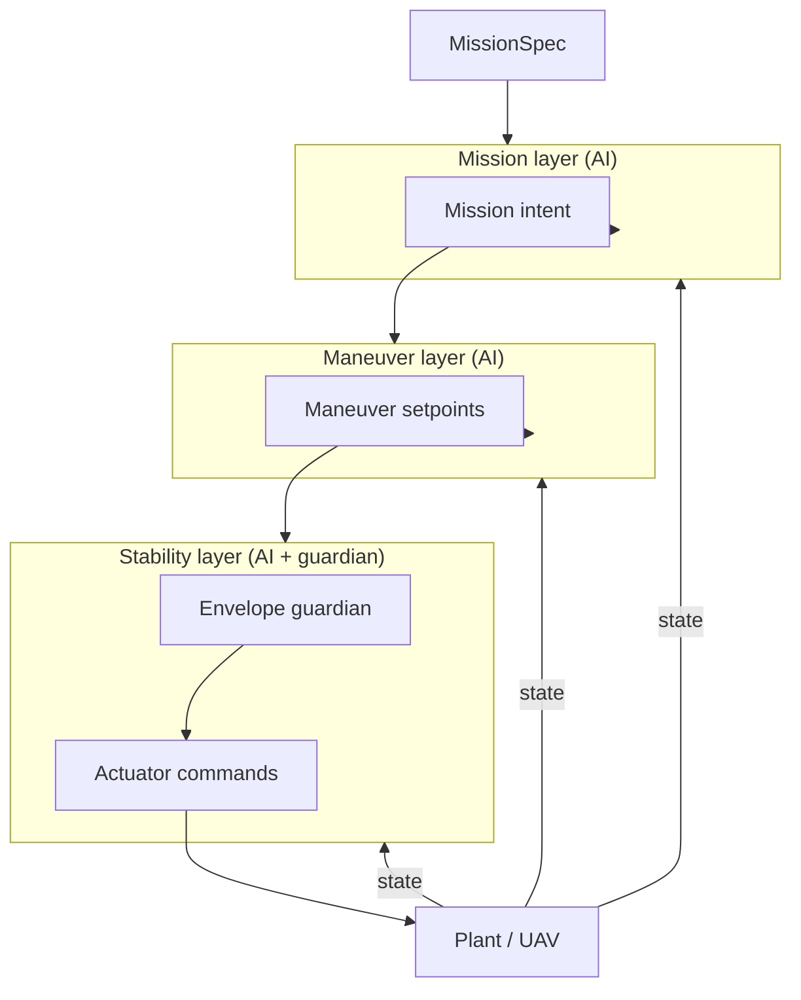

# Flight control architecture (AI-adaptive, fixed-wing)

Three cooperating **functions** (layers), each implemented as an **adaptive, AI-based policy** with a shared interface. A **stability guardian** inside the inner layer always enforces envelope limits, even when outer layers command aggressive maneuvers or mission changes.

## Design goals

| Goal | Approach |
|------|----------|
| Separation of concerns | Mission → maneuver → stability (setpoint cascade) |
| Adaptivity | Each layer exposes `adapt()` driven by tracking error and flight context |
| AI-ready | Policies are pluggable (`AdaptivePolicy`); start with lightweight online rules, replace with learned models per layer |
| Safety | Stability layer **clips and overrides** upstream commands to protect critical parameters |
| Testability | Same harness (`FlightControlStack`) for 1-D plant now and full fixed-wing later |

## Layer responsibilities

### 1. Stability — critical parameters and aircraft stability

**Purpose:** Keep the aircraft in a safe, controllable regime and track **inner** setpoints from the maneuver layer.

**Typical critical parameters (fixed-wing):**

- Attitude / body rates (roll, pitch, yaw and \(p,q,r\))
- Airspeed (stall margin)
- Load factor / bank limits
- Energy state (height + speed coupling)
- Actuator saturations and rate limits

**Outputs:** Low-level commands (elevator, aileron, rudder, throttle) or normalized equivalents in reduced models.

**AI role:** Adaptive inner-loop policy (e.g. gain scheduling network, L1-adaptive surrogate, or RL policy) that **tunes** tracking behavior from recent errors. Hard envelope logic stays **non-negotiable** (guardian), not learned.

### 2. Maneuver — transient flight behavior

**Purpose:** Execute **local** flight behaviors between mission segments: climb, descend, level turn, hold, approach-style profiles, etc.

**Inputs:** Mission intent (segment type, targets, constraints).

**Outputs:** **Maneuver setpoints** for stability: target attitude/ rates, target airspeed, altitude rate, coordinated-turn bank, etc.

**AI role:** Select and parameterize maneuvers (timing, aggressiveness, entry/exit conditions) from context—wind estimate, tracking error, remaining energy. Can be a policy over maneuver library or a generative reference trajectory model.

### 3. Mission — following the operational plan

**Purpose:** Advance the **mission state machine**: waypoints, loiter, RTL hooks, segment sequencing (no GCS in-repo yet—mission is data + logic).

**Inputs:** `MissionSpec` (ordered segments, constraints).

**Outputs:** **Mission intent** for the maneuver layer: active segment, desired track/ altitude/ speed schedule, completion criteria.

**AI role:** Adapt mission execution—speed/energy allocation along route, replanning margins, segment switching thresholds—based on performance history and environment estimates.

## Control flow



**Authority:** Commands flow downward; **constraints flow upward only as feedback** (errors, flags). The stability guardian may **reduce** maneuver setpoints implicitly by saturating actuators and reporting envelope activity in `AdaptationContext`.

## Adaptation loop

Each layer implements `AdaptivePolicy`:

1. **Observe** shared `FlightState` and layer-specific references.
2. **Act** one control step (produce outputs for the layer below or actuators).
3. **Adapt** (lower rate, e.g. 1–10 Hz): update internal parameters, network weights (slow fine-tune), or meta-gains from `AdaptationContext` (tracking RMSE, saturation duty, segment progress).

Adaptation must be **bounded** (max gain change per step) for flight safety during learning.

## Mapping to full fixed-wing (future)

| Layer | ArduPilot-like analogue | Setpoints |
|-------|-------------------------|-----------|
| Mission | `AP_Mission` + path manager | WP sequence, alt/speed profile |
| Maneuver | Mode-specific profiles (FBWA, AUTO submodes) | Roll/pitch/ speed targets |
| Stability | Attitude/rate PIDs + TECS inner | Surfaces, throttle |

The repo now includes a **simplified fixed-wing plant** (position, altitude, airspeed, heading, bank) plus a **1-D legacy harness** for fast vertical-only tests. Longitudinal inner loop uses **adaptive TECS**; lateral maneuvering uses **level-turn** bank commands; mission supports **NED waypoint routes**.

## Implementation in this repository

| Module | Role |
|--------|------|
| `state.py` | `FlightState`, setpoints, `MissionSpec`, `AdaptationContext` |
| `layers/base.py` | `AdaptivePolicy` protocol |
| `layers/mission.py` | Mission AI policy (reference) |
| `layers/maneuver.py` | Maneuver AI policy (reference) |
| `layers/stability.py` | Stability AI policy + guardian (reference) |
| `stack.py` | `FlightControlStack` orchestration |

Reference policies use **transparent online adaptation** (error-driven gain tweaks). Trained **NumPy MLP** policies live under `policies/weights/` and are loaded per layer.

## Neural policy rollout order

1. **Stability** — `NeuralStabilityPolicy` (+ non-learned guardian)  
2. **Maneuver** — `NeuralManeuverPolicy`  
3. **Mission** — `NeuralMissionPolicy` (modulates capture/tolerance scales)

Train in order (behavioral cloning from reference teachers):

```bash
python3 scripts/train_policies.py
```

Select policies via `PolicyConfig` / `FlightControlStack.from_policy_config()`:

```python
from ai_flight_control.policy_config import PolicyConfig
from ai_flight_control.stack import FlightControlStack

stack = FlightControlStack.from_policy_config(
    PolicyConfig(stability="neural", maneuver="reference", mission="reference"),
)
```

Use `PolicyConfig.all_neural()` when all three weight files are trained.

### Wind

`WindField` (steady NED + optional gusts) drives ground-track integration in `step_fixed_wing`.  
`FlightState.wind_n_m_s` / `wind_e_m_s` feed all three neural feature vectors.

### Embedded export

After training, `scripts/export_policies.py` emits:

- `policies/weights/embedded/*.json` — flat weights for any runtime  
- `policies/weights/embedded/*.h` — C `*_forward()` inference stubs  
- `manifest.json` — input/hidden/output dims per layer  
